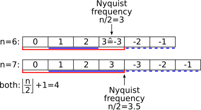
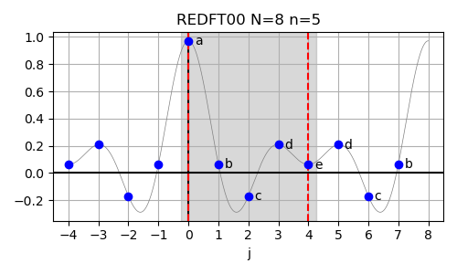
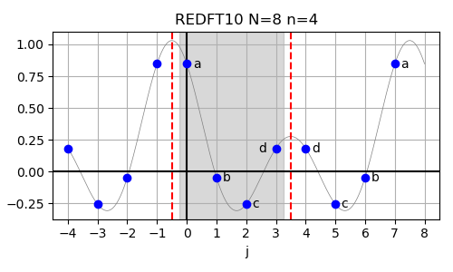
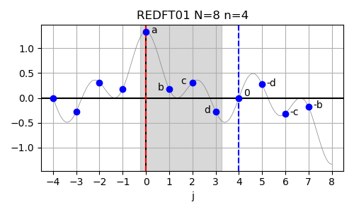
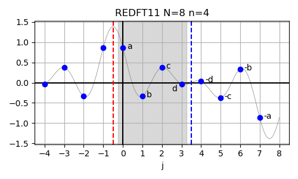
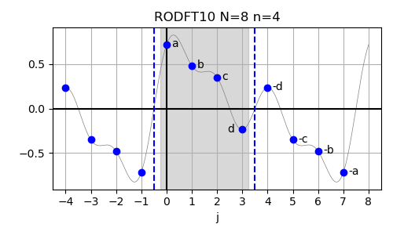
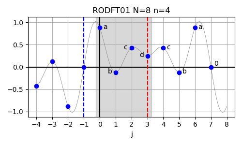
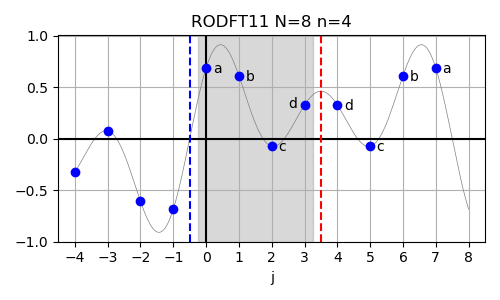

# FFTW Tutorial

This is a basic C project (Makefile, but also for the Eclipse IDE) I use for exploring FFTW 3.3.9.

One- and two-dimensional discrete Fourier transforms (DFTs) of random data are computed using both FFTW and straight-forward naive algorithms
in order to illustrate explicitly what kind of symmetries and scaling properties FFTW implies in its inputs and outputs.

## Table of Contents:
1. [One-Dimensional Examples](https://github.com/jonathanschilling/fftw_tutorial#one-dimensional-examples)
   1. [1D complex-to-complex](https://github.com/jonathanschilling/fftw_tutorial#1d-complex-to-complex)
   2. [1D complex-to-real and real-to-complex](https://github.com/jonathanschilling/fftw_tutorial#1d-complex-to-real-and-real-to-complex)
   3. [1D real-to-real](https://github.com/jonathanschilling/fftw_tutorial#1d-real-to-real)
      1. [REDFT00 (DCT-I)](https://github.com/jonathanschilling/fftw_tutorial#redft00-dct-i)
      2. [REDFT10 (DCT-II)](https://github.com/jonathanschilling/fftw_tutorial#redft10-dct-ii)
      3. [REDFT01 (DCT-III)](https://github.com/jonathanschilling/fftw_tutorial#redft01-dct-iii)
      4. [REDFT11 (DCT-IV)](https://github.com/jonathanschilling/fftw_tutorial#redft11-dct-iv)
      5. [RODFT00 (DST-I)](https://github.com/jonathanschilling/fftw_tutorial#rodft00-dst-i)
      6. [RODFT10 (DST-II)](https://github.com/jonathanschilling/fftw_tutorial#rodft10-dst-ii)
      7. [RODFT01 (DST-III)](https://github.com/jonathanschilling/fftw_tutorial#rodft01-dst-iii)
      8. [RODFT11 (DST-IV)](https://github.com/jonathanschilling/fftw_tutorial#rodft11-dst-iv)
2. [Two-Dimensional Examples](https://github.com/jonathanschilling/fftw_tutorial#two-dimensional-examples)
   1. [2D complex-to-complex](https://github.com/jonathanschilling/fftw_tutorial#2d-complex-to-complex)
   2. [2D complex-to-real](https://github.com/jonathanschilling/fftw_tutorial#2d-complex-to-real)
   3. [2D real-to-complex](https://github.com/jonathanschilling/fftw_tutorial#2d-real-to-complex)
3. [Allocation of arrays](https://github.com/jonathanschilling/fftw_tutorial#allocation-of-arrays)
4. [Utility functions](https://github.com/jonathanschilling/fftw_tutorial#utility-functions)

## One-Dimensional Examples
This tutorial starts by computing one-dimensional (1D) DFTs of random input data.

### 1D complex-to-complex
The first example is basically a self-contained version of the [corresponding example in the FFTW manual](http://fftw.org/fftw3_doc/Complex-One_002dDimensional-DFTs.html#Complex-One_002dDimensional-DFTs). 

We want to compute the complex-valued one-dimensional DFT here, which is specified in [section 4.8.1 of the FFTW reference manual](http://fftw.org/fftw3_doc/The-1d-Discrete-Fourier-Transform-_0028DFT_0029.html#The-1d-Discrete-Fourier-Transform-_0028DFT_0029).


The sign in the exponent of the basis function specifies the direction in which the Fourier transform is to be computed:
`-1` indicates a "forward" transform and `+1` indicates a backward transform. These values are available via the `FFTW_FORWARD` and `FFTW_BACKWARD` preprocessor macros.

In order to compute the DFT, complex-valued products of the following form need to be evaluated:


Eulers formula comes in handy now (where *i* is the imaginary unit with *i*^2=-1):


The angle argument `phi` can be identified in above formulas for the DFT:


Now the complex-valued product can be computed using only real-valued variables:


FFTW implements all this math internally and the explicit formulation was only used to build a basis for the computations to follow.
Below is the example code showing how to compute the 1d `c2c` DFT using both FFTW and a manual implementation.
The size of the DFT is specified via the variable `n` and the direction (forward or backward) is specified via the variable `dir`.
Complex-valued arrays `in`, `ref_out` and `fftw_out` are allocated to hold the input (*X_k*) and outputs (*Y_k*) of the DFT.
A plan for the corresponding DFT is created using `fftw_plan_dft_1d`.
Only after this, the input data is written into the `in` array.
The reference output is computed now (before calling `fftw_execute`), since in some later examples (most notably multi-dimensional `c2r` transforms),
FFTW overwrites the input data and for good practise, we keep this in mind already now.
Note that this is an out-of-place transform, since `in` and `fftw_out` are allocated to be separate arrays.
Next the FFTW transform can be executed via `fftw_execute`.
This fills the corresponding output array `fftw_out`, which is subsequently compared against the reference output in `ref_out`.
A conservative tolerance of `1e-12` is specified to make the example work also for weird input data (as generated by the PRNG).
The actual deviations are usually much smaller and can be observed in the screen output from `compare_1d_cplx`.
Finally, the `fftw_plan` is destroyed and the memory is released using `fftw_free` (which has to be used if the array was allocated using `fftw_alloc_*`).

```C
#include <stdio.h>
#include <stdlib.h>
#include <math.h>

#include <complex.h>
#include <fftw3.h>

#include "util.h"

int test_1d_c2c(int n) {

    int dir = FFTW_BACKWARD;
    double real, imag, phi;

    fftw_complex *in = fftw_alloc_complex(n);
    fftw_complex *ref_out = fftw_alloc_complex(n);
    fftw_complex *fftw_out = fftw_alloc_complex(n);

    fftw_plan p = fftw_plan_dft_1d(n, in, fftw_out, dir, FFTW_ESTIMATE);

    // fill the input array with random data
    fill_random_1d_cplx(n, in);

    // compute the reference output
    for (int k = 0; k < n; ++k) {
        ref_out[k] = 0.0;
        for (int j = 0; j < n; ++j) {
            phi = dir * 2.0 * M_PI * j * k / ((double) n);

            real = creal(in[j]) * cos(phi) - cimag(in[j]) * sin(phi);
            imag = creal(in[j]) * sin(phi) + cimag(in[j]) * cos(phi);
            ref_out[k] += real + I * imag;
        }
    }

    // compute the DFT of in using FFTW
    fftw_execute(p);

    // compare reference output with FFTW output
    double eps = 1e-12;
    int status = compare_1d_cplx(n, ref_out, fftw_out, eps);

    fftw_destroy_plan(p);
    fftw_free(in);
    fftw_free(ref_out);
    fftw_free(fftw_out);

    return status;
}

int main(int argc, char** argv) {
    int status = 0;
    status += test_1d_c2c(32);
    status += test_1d_c2c(33);
    return status;
}
```

The code is available in the file [`src/test_1d_c2c.c`](src/test_1d_c2c.c).

### 1D complex-to-real and real-to-complex
The next two examples deal with DFTs of purely real data (`r2c`) and DFTs which *produce* purely real data (`c2r`).
These are covered in the [official FFTW tutorial](http://fftw.org/fftw3_doc/One_002dDimensional-DFTs-of-Real-Data.html#One_002dDimensional-DFTs-of-Real-Data)
as well as in the [FFTW reference manual](http://fftw.org/fftw3_doc/The-1d-Real_002ddata-DFT.html#The-1d-Real_002ddata-DFT).

In case either the input array or the output array are constrained to be purely real, the corresponding complex-valued output or input array
features Hermitian symmetry (where the `n`-periodicity has been included as well):


For the case of a DFT of real-valued *X_j* and complex-valued *Y_k* with Hermitian symmetry,
the Fourier sum is written out excplicitly as follows:


The figure below illustrates the structure of the complex-valued Fourier space arrays
occuring in the DFT for both even-valued (`n=6`) and odd-valued (`n=7`) sizes of the DFT.



The size required to contain all information required for the transform from or to a real-valued array
is contained in the first `n/2+1` (division by 2 rounded down) entries of the complex array, indicated by the red bars in above figure.
For both even and odd values of `n`, Hermitian symmetry implies *Y_0* = *Y\*_0* and thus *Y_0* is always real.
In the case of even `n`, we can intuitively observe that *Y_m* = *Y\*_-m* where *m*=`n/2` (the element at the Nyquist frequency,
and thus also the last element of the complex-valued Fourier-space array) is also purely real.

The DFT formulation includes all elements of the Fourier-space array from 0 to `n-1`.
Now that only parts of these coefficients are taken into account, they have to be weighted appropriately
to recover the results that would have been obtained by using the full array without taking advantage of its symmetry properties.
For odd `n`, all components of the Fourier-space array except the DC element at *k*=0 have to be weighted with a factor of 2.
For even `n`, all components of the Fourier-space array except the DC element at *k*=0 and the Nyquist element at *k*=`n/2`
have to be weighted with a factor of 2.
The elements that need to be weighted by a factor of 2 are highlighted by solid blue lines in above illustration.
The redundant elements that are not explicitly needed are indicated by dashed blue lines.

The transformation from complex Fourier space to real-valued real space is demonstrated in [`src/test_1d_c2r.c`](src/test_1d_c2r.c).
The relevant portion of the source code is here:

```C
int nCplx = n / 2 + 1;
for (int k = 0; k < n; ++k) {

    // start with DC component, which is purely real due to Hermitian symmetry
    ref_out[k] = creal(in[0]);

    int loopEnd = nCplx;

    // special case for even n
    if (n % 2 == 0) {
        // Nyquist element is purely real as well
        phi = 2.0 * M_PI * (nCplx - 1) * k / ((double) n);
        ref_out[k] += creal(in[nCplx - 1]) * cos(phi);

        loopEnd = nCplx-1;
    }

    // middle elements are handled the same for even and odd n
    for (int j = 1; j < loopEnd; ++j) {
        phi = 2.0 * M_PI * j * k / ((double) n);

        real = creal(in[j]) * cos(phi) - cimag(in[j]) * sin(phi);
        ref_out[k] += 2.0 * real;
    }
}
```

Note that the integer division used to compute `nCplx` (correctly) rounds down.
The rest is a relatively straight-forward implementation of above verbose algorithm.
The DC component is always taken to be real.
Depending on whether `n` is even or odd, the number of elements to take into account with both real and imaginary component (`loopEnd`) is adjusted.
The (purely real) Nyquist element at `n/2` is added separately if `n` is even.
All other elements are weighted by a factor of 2 and only the real part
of the complex product of input Fourier coefficient and complex-valued basis function is actually computed.

The reverse transform from real space to Fourier space is comparably simple to implement:

```C
for (int k = 0; k < nCplx; ++k) {

    // DC component is always real
    ref_out[k] = in[0];

    for (int j = 1; j < n; ++j) {
        phi = -2.0 * M_PI * j * k / ((double) n);

        real = in[j] * cos(phi);
        imag = in[j] * sin(phi);
        ref_out[k] += real + I * imag;
    }
}
```

Note that in this case, only the non-redundant part of the complex-values Fourier coefficients need to be computed
from a real-valued input. The separate handling of the DC component is not strictly necessary, since `cos(0)=1` and `sin(0)=0`
and thus the DC component would get no imaginary contribution.
The full example is available in the file [`src/test_1d_r2c.c`](src/test_1d_r2c.c).

It becomes evident in above examples that the sign of a `c2r` DFT is always `FFTW_BACKWARD` and 
the sign of a `r2c` DFT is always `FFTW_FORWARD`.

### 1D real-to-real

Certain symmetries can be assumed for a given real input array of which a DFT is to be computed
that lead to the output array being purely real as well. This is another gain of a factor of 2 in speed
and memory usage over `r2c`/`c2r` transforms.
Depending on even (odd) parity of the input array, the transform outputs have even (odd) parity.
They are therefore called Discrete Cosine Transform (DCT) and Discrete Sine Transfrom (DST), respectively.

The logical size of the corresponding DFT is denoted as *N*.
The actual array size given to FFTW is denoted by `n`.
For the DCT/DST types implemented in FFTW, *N* is always even.
Note that this does not pose any restrictions on the input array sizes `n`.
One can think of the logical DFT input array as one that FFTW 'sees' internally and computes a regular DFT of.
The resulting output array is purely real and features the named symmetry properties,
since the logical input array was 'constructed' from the given input array to have the desired symmetry properties.

In below example plots used to illustrate these symmetry properties/assumptions,
random Fourier coefficients have been sampled and transformed back to real-space using the named inverse transforms.
This allows to 'evaluate' the input data also in the samples given in the (small) input arrays.
In these plots, red dashed vertical lines indicate even symmetry (*f(x)=f(-x)*) about the indicated position
and blue dashed vertical lines indicate odd symmetry (*f(x)=-f(-x)*) about the indicated position.
The grey-shaded area in the background indicated the range of samples that are included in the input array.
The x axis labels denote the indices in the actual input array given to FFTW (only valid within the range of the grey boxes).

The nomenclature works as follows:
The first letter is **R** to indicate real-valued data.
The second letter distinguished between **E** for even-parity data and **O** for odd-parity data.
The following **DFT** is for discrete Fourier transform (who guessed...).
The next two digits indicate wheter (**1**) or not (**0**) the input (first digit) or the output (second digit) data is shifted by half a sample.
Think of this in terms of parity: whether the symmetry axis is located at a sample (no shifting necessary) or between two samples (shifting necessary).
The shifting becomes necessary when formulating the symmetry properties over sampled data that has integer indices
vs. symmetry axis that are possibly located at half-integer locations.
The parity and symmetry properties of the output array are those of the input array for the inverse transform.

For all transforms, a periodicity of *N* is assumed for the *logical* input array as *X_j = X_{N+j}* where *X* is the input data array.

Here is a quick overview table to indicate the assumed symmetries in the input array for the following types of `r2r` DFTs:

| type    | actual `r2r` input | logically-equivalent DFT input |
| :------:| :---------: | :-------------------: |
| REDFT00 | `a b c d e` | `a b c d  e  d  c  b` |
| REDFT10 | `a b c d  ` | `a b c d  d  c  b  a` |
| REDFT01 | `a b c d  ` | `a b c d  0 -d -c -b` |
| REDFT11 | `a b c d  ` | `a b c d -d -c -b -a` |
| RODFT00 | `a b c    ` | `0 a b c  0 -c -b -a` |
| RODFT10 | `a b c d  ` | `a b c d -d -c -b -a` |
| RODFT01 | `a b c d  ` | `a b c d  c  b  a  0` |
| RODFT11 | `a b c d  ` | `a b c d  d  c  b  a` |

For the DCTs, please also consider https://en.wikipedia.org/wiki/Discrete_cosine_transform#Formal_definition
and in particular https://upload.wikimedia.org/wikipedia/commons/a/ae/DCT-symmetries.svg .

For the DSTs, please also consider https://en.wikipedia.org/wiki/Discrete_sine_transform#Definition
and in particular https://upload.wikimedia.org/wikipedia/commons/3/31/DST-symmetries.svg .

#### REDFT00 (DCT-I)

In case of the real-valued even-parity DFT with no shifts in either input or output array (REDFT00),
also called the DCT-I, the corresponding logical DFT size is given by *N* = 2(`n`-1), corresponding to `n` = *N*/2+1.

The formal definition of the REDFT00 is given below:


The inverse of this transform is REDFT00 itself.
The input array is assumed to have even symmetry around *j=0* and even symmetry also around *j=n−1*.



In above figure, the lowercase letters *a* to *e* refer to the input data *abcde* for the size-5 REDFT00,
which is logically equivalent to a size-8 DFT with real-valued input data *abcdedcb*.

In order to demonstrate the use of this method,
the logically equivalent DFT input is filled appropriately and its output is checked against `REDFT00`.
In the following code, `in` is the input array (size `n`) given to `REDFT00`
and `in_logical` is the (complex-valued) input array (size *N*) handed to a
[generic 1D DFT](https://en.wikipedia.org/wiki/Discrete_Fourier_transform#Generalized_DFT_(shifted_and_non-linear_phase)).
Similarly, `out` is the output array (size `n`) from `REDFT00`
and `out_logical` is the output array (size *N*) from a generic 1D DFT.

Here is how the symmetric input is generated:

```C
// the first half of the array is identical
for (int i=0; i<n; ++i) {
    in_logical[i] = in[i];
}

// second half is filled according to even symmetry around n-1
for (int i=0; i<n-1; ++i) {
    in_logical[n+i] = in[n-2-i];
}
```

The checks are a little bit more involved.
The logically equivalent DFT output should be purely real-valued:

```C
for (int i = 0; i < N; ++i) {
    if (fabs(cimag(out_logical[i])) > eps) {
        printf("error: imag of [%d] is %g\n", i, cimag(out_logical[i]));
        status = 1;
    } else {
        printf("imag of [%d] is %g\n", i, cimag(out_logical[i]));
    }
}
```

The first `n` values should be identical between `REDFT00` and the generalized DFT:

```C
double delta;
for (int i = 0; i < n; ++i) {
    delta = creal(out_logical[i]) - out[i];
    if (fabs(delta) > eps) {
        printf("error: delta of [%d] is %g\n", i, delta);
        status = 1;
    } else {
        printf("match of [%d] (delta=%g)\n", i, delta);
    }
}
```

The remaining values should have even symmetry around `n-1`:

```C
for (int i = 0; i < n - 2; ++i) {
    delta = creal(out_logical[n + i]) - out[n - 2 - i];
    if (fabs(delta) > eps) {
        printf("error: delta of [%d] is %g\n", n+i, delta);
        status = 1;
    } else {
        printf("match of [%d] (delta=%g)\n", n+i, delta);
    }
}
```

The full example can be found in [`src/test_1d_redft00.c`](src/test_1d_redft00.c).

#### REDFT10 (DCT-II)

In case of the real-valued even-parity DFT with shifted input data (REDFT10),
also called the DCT-II, the corresponding logical DFT size is given by *N* = 2`n`, corresponding to `n` = *N*/2.
This function is commonly known as "the" DCT.

The formal definition of the REDFT10 is given below:


The inverse of this transform is REDFT01.
The input array is assumed to have even symmetry around *j=-0.5* and even symmetry also around *j=n−0.5*.



In above figure, the lowercase letters *a* to *e* refer to the input data *abcd* for the size-4 REDFT10,
which is logically equivalent to a size-8 DFT with real-valued input data *abcddcba*.

In order to demonstrate the use of this method,
the logically equivalent DFT input is filled appropriately and its output is checked against `REDFT10`.
In the following code, `in` is the input array (size `n`) given to `REDFT10`
and `in_logical` is the (complex-valued) input array (size *N*) handed to a
[generic 1D DFT](https://en.wikipedia.org/wiki/Discrete_Fourier_transform#Generalized_DFT_(shifted_and_non-linear_phase)).
Similarly, `out` is the output array (size `n`) from `REDFT10`
and `out_logical` is the output array (size *N*) from a generic 1D DFT.

Here is how the symmetric input is generated:

```C
// the first half of the array is identical
for (int i = 0; i < n; ++i) {
    in_logical[i] = in[i];
}

// second half is filled according to even symmetry around n-0.5
for (int i = 0; i < n; ++i) {
    in_logical[n + i] = in[n - 1 - i];
}
```

The checks are a little bit more involved.
The logically equivalent DFT output should be purely real-valued:

```C
for (int i = 0; i < N; ++i) {
    if (fabs(cimag(out_logical[i])) > eps) {
        printf("error: imag of [%d] is %g\n", i, cimag(out_logical[i]));
        status = 1;
    } else {
        printf("imag of [%d] is %g\n", i, cimag(out_logical[i]));
    }
}
```

The first `n` values should be identical between `REDFT10` and the generalized DFT:

```C
for (int i = 0; i < n; ++i) {
    delta = creal(out_logical[i]) - out[i];
    if (fabs(delta) > eps) {
        printf("error: delta of [%d] is %g\n", i, delta);
        status = 1;
    } else {
        printf("match of [%d] (delta=%g)\n", i, delta);
    }
}
```

Odd symmetry around `n` implies that the value at `n` is zero:

```C
if (fabs(creal(out_logical[n])) > eps) {
    printf("error: delta of [%d] is %g\n", n, creal(out_logical[n]));
    status = 1;
} else {
    printf("match of [%d] (delta=%g)\n", n, creal(out_logical[n]));
}
```

The remaining values should have odd symmetry around `n`:

```C
for (int i = 1; i < n; ++i) {
    delta = creal(out_logical[n + i]) - (-out[n - i]);
    if (fabs(delta) > eps) {
        printf("error: delta of [%d] is %g\n", n + i, delta);
        status = 1;
    } else {
        printf("match of [%d] (delta=%g)\n", n + i, delta);
    }
}
```

The full example can be found in [`src/test_1d_redft10.c`](src/test_1d_redft10.c).

#### REDFT01 (DCT-III)

In case of the real-valued even-parity DFT with shifted output data (REDFT01),
also called the DCT-III, the corresponding logical DFT size is given by *N* = 2`n`, corresponding to `n` = *N*/2.
This function is commonly known as "the" inverse DCT (IDCT).

The formal definition of the REDFT01 is given below:


The inverse of this transform is REDFT10.
The input array is assumed to have even symmetry around *j=0* and odd symmetry around *j=n*.



In order to demonstrate the use of this method,
the logically equivalent DFT input is filled appropriately and its output is checked against `REDFT01`.
In the following code, `in` is the input array (size `n`) given to `REDFT01`
and `in_logical` is the (complex-valued) input array (size *N*) handed to a
[generic 1D DFT](https://en.wikipedia.org/wiki/Discrete_Fourier_transform#Generalized_DFT_(shifted_and_non-linear_phase)).
Similarly, `out` is the output array (size `n`) from `REDFT01`
and `out_logical` is the output array (size *N*) from a generic 1D DFT.

Here is how the symmetric input is generated:

```C
// the first half of the array is identical
for (int i = 0; i < n; ++i) {
    in_logical[i] = in[i];
}

// second half is filled according to odd symmetry around n
for (int i = 1; i < n; ++i) {
    in_logical[n + i] = -in[n - i];
}
```

The checks are a little bit more involved.
The logically equivalent DFT output should be purely real-valued:

```C
for (int i = 0; i < N; ++i) {
    if (fabs(cimag(out_logical[i])) > eps) {
        printf("error: imag of [%d] is %g\n", i, cimag(out_logical[i]));
        status = 1;
    } else {
        printf("imag of [%d] is %g\n", i, cimag(out_logical[i]));
    }
}
```

The first `n` values should be identical between `REDFT01` and the generalized DFT:

```C
for (int i = 0; i < n; ++i) {
    delta = creal(out_logical[i]) - out[i];
    if (fabs(delta) > eps) {
        printf("error: delta of [%d] is %g\n", i, delta);
        status = 1;
    } else {
        printf("match of [%d] (delta=%g)\n", i, delta);
    }
}
```

The remaining values should have even symmetry around `n-0.5`:

```C
for (int i = 0; i < n; ++i) {
    delta = creal(out_logical[n + i]) - out[n - 1 - i];
    if (fabs(delta) > eps) {
        printf("error: delta of [%d] is %g\n", n + i, delta);
        status = 1;
    } else {
        printf("match of [%d] (delta=%g)\n", n + i, delta);
    }
}
```

The full example can be found in [`src/test_1d_redft01.c`](src/test_1d_redft01.c).

#### REDFT11 (DCT-IV)

In case of the real-valued even-parity DFT with both shifted input and output data (REDFT11),
also called the DCT-IV, the corresponding logical DFT size is given by *N* = 2`n`, corresponding to `n` = *N*/2.

The formal definition of the REDFT11 is given below:


The inverse of this transform is REDFT11 itself.
The input array is assumed to have even symmetry around *j=-0.5* and odd symmetry around *j=n-0.5*.



In order to demonstrate the use of this method,
the logically equivalent DFT input is filled appropriately and its output is checked against `REDFT11`.
In the following code, `in` is the input array (size `n`) given to `REDFT11`
and `in_logical` is the (complex-valued) input array (size *N*) handed to a
[generic 1D DFT](https://en.wikipedia.org/wiki/Discrete_Fourier_transform#Generalized_DFT_(shifted_and_non-linear_phase)).
Similarly, `out` is the output array (size `n`) from `REDFT11`
and `out_logical` is the output array (size *N*) from a generic 1D DFT.

Here is how the symmetric input is generated:

```C
// the first half of the array is identical
for (int i = 0; i < n; ++i) {
    in_logical[i] = in[i];
}

// second half is filled according to odd symmetry around n-0.5
for (int i = 0; i < n; ++i) {
    in_logical[n + i] = -in[n - 1 - i];
}
```

The checks are a little bit more involved.
The logically equivalent DFT output should be purely real-valued:

```C
for (int i = 0; i < N; ++i) {
    if (fabs(cimag(out_logical[i])) > eps) {
        printf("error: imag of [%d] is %g\n", i, cimag(out_logical[i]));
        status = 1;
    } else {
        printf("imag of [%d] is %g\n", i, cimag(out_logical[i]));
    }
}
```

The first `n` values should be identical between `REDFT11` and the generalized DFT:

```C
for (int i = 0; i < n; ++i) {
    delta = creal(out_logical[i]) - out[i];
    if (fabs(delta) > eps) {
        printf("error: delta of [%d] is %g\n", i, delta);
        status = 1;
    } else {
        printf("match of [%d] (delta=%g)\n", i, delta);
    }
}
```

The remaining values should have odd symmetry around `n-0.5`:

```C
for (int i = 0; i < n; ++i) {
    delta = creal(out_logical[n + i]) - (-out[n - 1 - i]);
    if (fabs(delta) > eps) {
        printf("error: delta of [%d] is %g\n", n + i, delta);
        status = 1;
    } else {
        printf("match of [%d] (delta=%g)\n", n + i, delta);
    }
}
```

The full example can be found in [`src/test_1d_redft11.c`](src/test_1d_redft11.c).

#### RODFT00 (DST-I)

In case of the real-valued odd-parity DFT with no shifts in either input or output array (RODFT00),
also called the DST-I, the corresponding logical DFT size is given by *N* = 2(`n`+1), corresponding to `n` = *N*/2-1.
Note that the periodicity of *N* of the logical input array in combination with odd symmetry *X_j = -X_{n-j}*
leads to *X_0 = -X_0* which is equivalent to *X_0 = 0*.
This first always-zero element of the input array is not explicitly included in the input to FFTW
and the input array thus has a size of one less and the indices of the symmetry axis shift by 1.

The formal definition of the RODFT00 is given below:


The inverse of this transform is RODFT00 itself.
The input array is assumed to have odd symmetry around *j=-1* and odd symmetry also around *j=n*.


In order to demonstrate the use of this method,
the logically equivalent DFT input is filled appropriately and its output is checked against `RODFT00`.
In the following code, `in` is the input array (size `n`) given to `RODFT00`
and `in_logical` is the (complex-valued) input array (size *N*) handed to a
[generic 1D DFT](https://en.wikipedia.org/wiki/Discrete_Fourier_transform#Generalized_DFT_(shifted_and_non-linear_phase)).
Similarly, `out` is the output array (size `n`) from `RODFT00`
and `out_logical` is the output array (size *N*) from a generic 1D DFT.

Here is how the symmetric input is generated:

```C
// the first half of the array is identical
// except the first 0 (and the rest of the array being shifted)
in_logical[0] = 0.0;
for (int i = 0; i < n; ++i) {
    in_logical[i + 1] = in[i];
}

// second half is filled according to odd symmetry around (n+1)
in_logical[n + 1] = 0.0;
for (int i = 0; i < n; ++i) {
    in_logical[n + 2 + i] = -in[n - 1 - i];
}
```

The checks are a little bit more involved.
The logically equivalent DFT output should be purely imaginary-valued:

```C
for (int i = 0; i < N; ++i) {
    if (fabs(creal(out_logical[i])) > eps) {
        printf("error: real of [%d] is %g\n", i, creal(out_logical[i]));
        status = 1;
    } else {
        printf("real of [%d] is %g\n", i, creal(out_logical[i]));
    }
}
```

Odd symmetry about `0` implies that the imaginary part of the first output should be zero:

```C
if (fabs(cimag(out_logical[0])) > eps) {
    printf("error: delta of [%d] is %g\n", 0, -cimag(out_logical[0]));
    status = 1;
} else {
    printf("match of [%d] (delta=%g)\n", 0, -cimag(out_logical[0]));
}
```

The next `n` values should have the output of `RODFT00` in their negative imaginary parts
with one index offset to account for the first zero in the input:

```C
for (int i = 0; i < n; ++i) {
    delta = -cimag(out_logical[i + 1]) - out[i];
    if (fabs(delta) > eps) {
        printf("error: delta of [%d] is %g\n", i + 1, delta);
        status = 1;
    } else {
        printf("match of [%d] (delta=%g)\n", i + 1, delta);
    }
}
```

Odd symmetry about `n` in the input to `RODFT00` implies
odd symmetry in the output of the logically-equivalent DFT about `n+1` due to the index shift by one:

```C
if (fabs(cimag(out_logical[n + 1])) > eps) {
    printf("error: delta of [%d] is %g\n", n + 1,
            -cimag(out_logical[n + 1]));
    status = 1;
} else {
    printf("match of [%d] (delta=%g)\n", n + 1, -cimag(out_logical[n + 1]));
}
```

The remaining values should have odd symmetry around `n+1`
(note again that the real output from `RODFT00` needs to be compared against
the negative imaginary parts in the output of the logically equivalent DFT shifted by one full index):

```C
for (int i = 0; i < n; ++i) {
    delta = -cimag(out_logical[n + 2 + i]) - (-out[n - 1 - i]);
    if (fabs(delta) > eps) {
        printf("error: delta of [%d] is %g\n", n + 2 + i, delta);
        status = 1;
    } else {
        printf("match of [%d] (delta=%g)\n", n + 2 + i, delta);
    }
}
```

The full example can be found in [`src/test_1d_rodft00.c`](src/test_1d_rodft00.c).

#### RODFT10 (DST-II)

In case of the real-valued odd-parity DFT with shifted input data (RODFT10),
also called the DST-II, the corresponding logical DFT size is given by *N* = 2`n`, corresponding to `n` = *N*/2.
This function is commonly known as "the" DST.

The formal definition of the RODFT10 is given below:


The inverse of this transform is RODFT01.
The input array is assumed to have odd symmetry around *j=-0.5* and odd symmetry also around *j=n-0.5*.



In order to demonstrate the use of this method,
the logically equivalent DFT input is filled appropriately and its output is checked against `RODFT10`.
In the following code, `in` is the input array (size `n`) given to `RODFT10`
and `in_logical` is the (complex-valued) input array (size *N*) handed to a
[generic 1D DFT](https://en.wikipedia.org/wiki/Discrete_Fourier_transform#Generalized_DFT_(shifted_and_non-linear_phase)).
Similarly, `out` is the output array (size `n`) from `RODFT10`
and `out_logical` is the output array (size *N*) from a generic 1D DFT.

Here is how the symmetric input is generated:

```C
// the first half of the array is identical
for (int i = 0; i < n; ++i) {
    in_logical[i] = in[i];
}

// second half is filled according to odd symmetry around (n-0.5)
for (int i = 0; i < n; ++i) {
    in_logical[n + i] = -in[n - 1 - i];
}
```

The checks are a little bit more involved.
The logically equivalent DFT output should be purely imaginary-valued:

```C
for (int i = 0; i < N; ++i) {
    if (fabs(creal(out_logical[i])) > eps) {
        printf("error: real of [%d] is %g\n", i, creal(out_logical[i]));
        status = 1;
    } else {
        printf("real of [%d] is %g\n", i, creal(out_logical[i]));
    }
}
```

The output of `RODFT10` is shifted by one index to the left with respect to the logically-equivalent DFT,
since the first input is constrained to be zero (resulting in odd parity about `-1` in the input to `RODFT10`).
Odd symmetry about `0` implies that the imaginary part of the first output should be zero:

```C
if (fabs(cimag(out_logical[0])) > eps) {
    printf("error: delta of [%d] is %g\n", 0, -cimag(out_logical[0]));
    status = 1;
} else {
    printf("match of [%d] (delta=%g)\n", 0, -cimag(out_logical[0]));
}
```

The next `n` values should have the output of `RODFT10` in their negative imaginary parts
with one index offset to account for the first zero in the input:

```C
for (int i = 0; i < n; ++i) {
    delta = -cimag(out_logical[i + 1]) - out[i];
    if (fabs(delta) > eps) {
        printf("error: delta of [%d] is %g\n", i + 1, delta);
        status = 1;
    } else {
        printf("match of [%d] (delta=%g)\n", i + 1, delta);
    }
}
```

The remaining values have even symmetry around `n-1`
(note again that the real output from `RODFT10` needs to be compared against
the negative imaginary parts in the output of the logically equivalent DFT shifted by one full index):

```C
for (int i = 0; i < n - 1; ++i) {
    delta = -cimag(out_logical[n + 1 + i]) - out[n - 2 - i];
    if (fabs(delta) > eps) {
        printf("error: delta of [%d] is %g\n", n + 1 + i, delta);
        status = 1;
    } else {
        printf("match of [%d] (delta=%g)\n", n + 1 + i, delta);
    }
}
```

The full example can be found in [`src/test_1d_rodft10.c`](src/test_1d_rodft10.c).

#### RODFT01 (DST-III)

In case of the real-valued odd-parity DFT with shifted output data (RODFT01),
also called the DST-III, the corresponding logical DFT size is given by *N* = 2`n`, corresponding to `n` = *N*/2.
This function is commonly known as "the" inverse DST (IDST).

The formal definition of the RODFT01 is given below:


The inverse of this transform is RODFT10.
The input array is assumed to have odd symmetry around *j=-1* and even symmetry around *j=n-1*.



In order to demonstrate the use of this method,
the logically equivalent DFT input is filled appropriately and its output is checked against `RODFT01`.
In the following code, `in` is the input array (size `n`) given to `RODFT01`
and `in_logical` is the (complex-valued) input array (size *N*) handed to a
[generic 1D DFT](https://en.wikipedia.org/wiki/Discrete_Fourier_transform#Generalized_DFT_(shifted_and_non-linear_phase)).
Similarly, `out` is the output array (size `n`) from `RODFT01`
and `out_logical` is the output array (size *N*) from a generic 1D DFT.

The input of `RODFT01` is shifted by one index to the left with respect to the logically-equivalent DFT,
since the first input is constrained to be zero (resulting in odd parity about `-1` in the input to `RODFT01`).
Here is how the symmetric input is generated:

```C
// a zero in the first entry is needed to satisfy
// odd symmetry about -1 in the shifted input array
in_logical[0] = 0.0;

// the first half of the array is identical up to shift
for (int i = 0; i < n; ++i) {
    in_logical[i + 1] = in[i];
}

// second half is filled according to even symmetry around (n-1)
for (int i = 0; i < n - 1; ++i) {
    in_logical[n + 1 + i] = in[n - 2 - i];
}
```

The checks are a little bit more involved.
The logically equivalent DFT output should be purely imaginary-valued:

```C
for (int i = 0; i < N; ++i) {
    if (fabs(creal(out_logical[i])) > eps) {
        printf("error: real of [%d] is %g\n", i, creal(out_logical[i]));
        status = 1;
    } else {
        printf("real of [%d] is %g\n", i, creal(out_logical[i]));
    }
}
```

The first `n` values should have the output of `RODFT01` in their negative imaginary parts:

```C
for (int i = 0; i < n; ++i) {
    delta = -cimag(out_logical[i]) - out[i];
    if (fabs(delta) > eps) {
        printf("error: delta of [%d] is %g\n", i, delta);
        status = 1;
    } else {
        printf("match of [%d] (delta=%g)\n", i, delta);
    }
}
```

The remaining values have odd symmetry around `n-0.5`
(note again that the real output from `RODFT01` needs to be compared against
the negative imaginary parts in the output of the logically equivalent DFT shifted by one full index):

```C
for (int i = 0; i < n; ++i) {
    delta = -cimag(out_logical[n + i]) - (-out[n - 1 - i]);
    if (fabs(delta) > eps) {
        printf("error: delta of [%d] is %g\n", n + i, delta);
        status = 1;
    } else {
        printf("match of [%d] (delta=%g)\n", n + i, delta);
    }
}
```

The full example can be found in [`src/test_1d_rodft01.c`](src/test_1d_rodft01.c).

#### RODFT11 (DST-IV)

In case of the real-valued odd-parity DFT with both shifted input and output data (RODFT11),
also called the DST-IV, the corresponding logical DFT size is given by *N* = 2`n`, corresponding to `n` = *N*/2.

The formal definition of the RODFT11 is given below:


The inverse of this transform is RODFT11 itself.
The input array is assumed to have odd symmetry around *j=-0.5* and even symmetry around *j=n-0.5*.



In order to demonstrate the use of this method,
the logically equivalent DFT input is filled appropriately and its output is checked against `RODFT11`.
In the following code, `in` is the input array (size `n`) given to `RODFT11`
and `in_logical` is the (complex-valued) input array (size *N*) handed to a
[generic 1D DFT](https://en.wikipedia.org/wiki/Discrete_Fourier_transform#Generalized_DFT_(shifted_and_non-linear_phase)).
Similarly, `out` is the output array (size `n`) from `RODFT11`
and `out_logical` is the output array (size *N*) from a generic 1D DFT.

Here is how the symmetric input is generated:

```C
// the first half of the array is identical up to shift
for (int i = 0; i < n; ++i) {
    in_logical[i] = in[i];
}

// second half is filled according to even symmetry around (n-0.5)
for (int i = 0; i < n; ++i) {
    in_logical[n + i] = in[n - 1 - i];
}
```

The checks are a little bit more involved.
The logically equivalent DFT output should be purely imaginary-valued:

```C
for (int i = 0; i < N; ++i) {
    if (fabs(creal(out_logical[i])) > eps) {
        printf("error: real of [%d] is %g\n", i, creal(out_logical[i]));
        status = 1;
    } else {
        printf("real of [%d] is %g\n", i, creal(out_logical[i]));
    }
}
```

The first `n` values should have the output of `RODFT11` in their negative imaginary parts:

```C
for (int i = 0; i < n; ++i) {
    delta = -cimag(out_logical[i]) - out[i];
    if (fabs(delta) > eps) {
        printf("error: delta of [%d] is %g\n", i, delta);
        status = 1;
    } else {
        printf("match of [%d] (delta=%g)\n", i, delta);
    }
}
```

The remaining values have even symmetry around `n-0.5`
(note again that the real output from `RODFT11` needs to be compared against
the negative imaginary parts in the output of the logically equivalent DFT):

```C
for (int i = 0; i < n; ++i) {
    delta = -cimag(out_logical[n + i]) - out[n - 1 - i];
    if (fabs(delta) > eps) {
        printf("error: delta of [%d] is %g\n", n + i, delta);
        status = 1;
    } else {
        printf("match of [%d] (delta=%g)\n", n + i, delta);
    }
}
```

The full example can be found in [`src/test_1d_rodft11.c`](src/test_1d_rodft11.c).

## Two-Dimensional Examples
The next section deals with the computation of two-dimensional (2D) DFTs of random input data.

### 2D complex-to-complex

A first example for the computation of two-dimensional Fourier transforms using FFTW is given here:

```C
#include <stdio.h>
#include <stdlib.h>
#include <math.h>

#include <complex.h>
#include <fftw3.h>

#include "util.h"

int test_2d_c2c(int n0, int n1) {
    int dir = FFTW_FORWARD;

    fftw_complex *in = fftw_alloc_complex(n0 * n1);
    fftw_complex *out = fftw_alloc_complex(n0 * n1);
    fftw_complex *ref_out = fftw_alloc_complex(n0 * n1);

    fftw_plan p = fftw_plan_dft_2d(n0, n1, in, out, dir, FFTW_ESTIMATE);

    // random input
    fill_random_2d_cplx(n0, n1, in);

    // manually compute DFT for reference
    int idx_k, idx_j;
    double phi;
    for (int k0 = 0; k0 < n0; ++k0) {
        for (int k1 = 0; k1 < n1; ++k1) {
            idx_k = k0 * n1 + k1;

            ref_out[idx_k] = 0.0;

            for (int j0 = 0; j0 < n0; ++j0) {
                for (int j1 = 0; j1 < n1; ++j1) {
                    idx_j = j0 * n1 + j1;

                    phi = dir * 2.0 * M_PI * (
                              k0 * j0 / ((double) n0)
                            + k1 * j1 / ((double) n1) );

                    ref_out[idx_k] += in[idx_j] * cexp(I * phi);
                }
            }
        }
    }

    fftw_execute(p);

    // compare outputs
    double eps = 1.0e-12;
    int status = compare_2d_cplx(n0, n1, ref_out, out, eps);

    return status;
}

int main(int argc, char **argv) {
    int status = 0;
    status += test_2d_c2c(4, 4);
    status += test_2d_c2c(4, 5);
    status += test_2d_c2c(5, 4);
    status += test_2d_c2c(5, 5);
    return status;
}
```

As usual, arrays are allocated to the specified size and filled with random data.
The two-dimensional complex-valued DFT is computed manually for reference
and the outputs are compared against the result of FFTW.
The product of the one-dimensional DFTs along the two dimensions is computed here
via addition of the corresponding phases in the exponent of the complex-valued basis function.

The code can be found in [`src/test_2d_c2c.c`](src/test_2d_c2c.c).

### 2D complex-to-real

The two-dimensional `c2r` transform can make use of the Hermitian symmetry
([see above](https://github.com/jonathanschilling/fftw_tutorial#1d-complex-to-real-and-real-to-complex))
to reduce the computational work in the *last* dimension of the input data by about a factor of 2.
The input data thus has to have a shape of (`n0`x`n1_cplx`) where `n1_cplx = n1/2+1` (division by 2 rounded down)
and (`n0`x`n1`) is the logical size of the DFT and also the size of the real-valued output arrays.

The arrays are allocated as follows:

```C
fftw_complex *in = fftw_alloc_complex(n0 * n1_cplx);
double *out = fftw_alloc_real(n0 * n1);
double *ref_out = fftw_alloc_real(n0 * n1);
```

The manual transform that is computed for reference is done as follows:

```C
int idx_k, idx_j;
double phi, real;
for (int k0 = 0; k0 < n0; ++k0) {
    for (int k1 = 0; k1 < n1; ++k1) {
        idx_k = k0 * n1 + k1;

        ref_out[idx_k] = 0.0;

        for (int j0 = 0; j0 < n0; ++j0) {
            for (int j1 = 0; j1 < n1_cplx; ++j1) {
                idx_j = j0 * n1_cplx + j1;

                phi = 2.0 * M_PI * (  k0 * j0 / ((double) n0)
                                    + k1 * j1 / ((double) n1) );

                // output is purely real,
                // so compute only real part
                real = creal(in[idx_j]) * cos(phi) - cimag(in[idx_j]) * sin(phi);

                ref_out[idx_k] += real;

                // add symmetric entries twice
                // n1/2+n1%2 is n1/2 if n1 is even
                // and it is n1/2+1 if n1 is odd
                if (j1 > 0 && j1 < n1 / 2 + n1 % 2) {
                    ref_out[idx_k] += real;
                }
            }
        }
    }
}
```

The full example can be found in [`src/test_2d_c2r.c`](src/test_2d_c2r.c).

### 2D real-to-complex

The two-dimensional `r2c` transform can make use of the Hermitian symmetry
([see above](https://github.com/jonathanschilling/fftw_tutorial#1d-complex-to-real-and-real-to-complex))
to reduce the computational work in the *last* dimension of the output data by about a factor of 2.
The output data thus has to have a shape of (`n0`x`n1_cplx`) where `n1_cplx = n1/2+1` (division by 2 rounded down)
and (`n0`x`n1`) is the logical size of the DFT and also the size of the real-valued input array.

The arrays are allocated as follows:

```C
double *in = fftw_alloc_real(n0 * n1);
fftw_complex *out = fftw_alloc_complex(n0 * n1_cplx);
fftw_complex *ref_out = fftw_alloc_complex(n0 * n1_cplx);
```

The manual transform that is computed for reference is done as follows:

```C
int idx_k, idx_j;
double phi;
for (int k0 = 0; k0 < n0; ++k0) {
    for (int k1 = 0; k1 < n1_cplx; ++k1) {
        idx_k = k0 * n1_cplx + k1;

        ref_out[idx_k] = 0.0;

        for (int j0 = 0; j0 < n0; ++j0) {
            for (int j1 = 0; j1 < n1; ++j1) {
                idx_j = j0 * n1 + j1;

                phi = -2.0 * M_PI * (  k0 * j0 / ((double) n0)
                                     + k1 * j1 / ((double) n1) );

                ref_out[idx_k] += in[idx_j] * cexp(I*phi);
            }
        }
    }
}
```

The full example can be found in [`src/test_2d_r2c.c`](src/test_2d_r2c.c).

## Allocation of arrays
Throughout this example collection, the proposed convenience wrapper functions provided by FFTW for allocating real- and complex-valued arrays are used:
```C
int n = 32;
int nOut = n/2+1;
double *in = fftw_alloc_real(n);
fftw_complex *out = fftw_alloc_complex(nOut);
```
where `N` is the real-space size of the DFT and `outN` is the number of Fourier coefficients resulting from a `r2c` DFT.
The corresponding "raw" allocation code would look like this:
```C
double *in = (double*) fftw_malloc(sizeof(double) * n);
fftw_complex *out = (fftw_complex*) fftw_malloc(sizeof(fftw_complex) * nOut);
```
Note that above code is equivalent to the standard C way of allocating memory using `malloc`:
```C
double *in = (double*) malloc(sizeof(double) * n);
fftw_complex *out = (fftw_complex*) malloc(sizeof(fftw_complex) * nOut);
```
except that the FFTW routines ensure proper memory alignment for exploiting SIMD instructions of modern CPUs.

## Utility functions
In order to keep the examples short, a separate header file [`src/util.h`](src/util.h) is provided.
It contains methods to operate on one- and two-dimensional arrays (the latter stored in row-major order)
of real (`double`) and complex (`fftw_complex`) numbers.
The following operations are supported:
 * fill with random numbers between 0 and 1: e.g. `fill_random_1d_cplx`
 * element-wise check for approximate equality: e.g. `compare_1d_real`
 * write into a text file: e.g. `dump_1d_real`
 * compute generalized DFT (shift and non-linear phase): `dft_1d_cplx`

